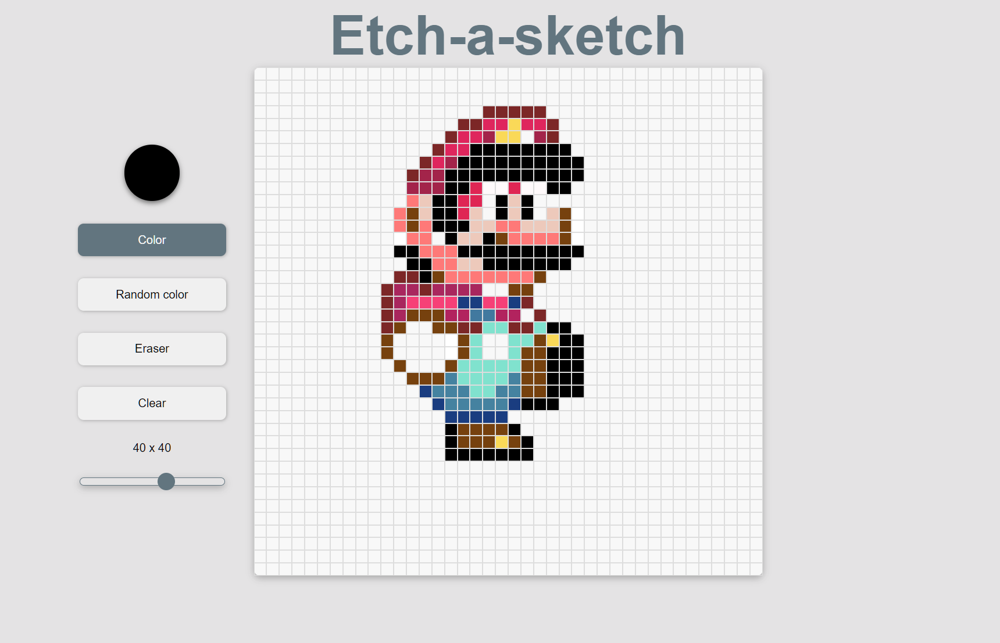

An online drawing tool with scalable pixel-like grids.

This project was built as part of The Odin Project to practice and showcase my ability to utilize DOM manipulation and event listeners.

This project gave me a deeper understanding on DOM manipulation, how bubbling works, and how each aspect of the page (html, css, JS) interacts with each other.

[Link to live page](https://jonathan-d-n.github.io/TOP-Etch-a-Sketch/)

## Features

### Change pixel size

You can choose the size and amount of pixels with the slider on the left

### Color settings

You can choose your color with the color-picker on the left

You can also choose the 'Random color' button on the left for rainbow colors.

### Clear
You can select the clear button on the left to clear the grid, or the eraser button to erase things yourself.